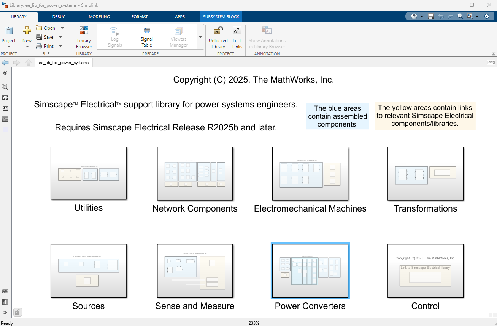
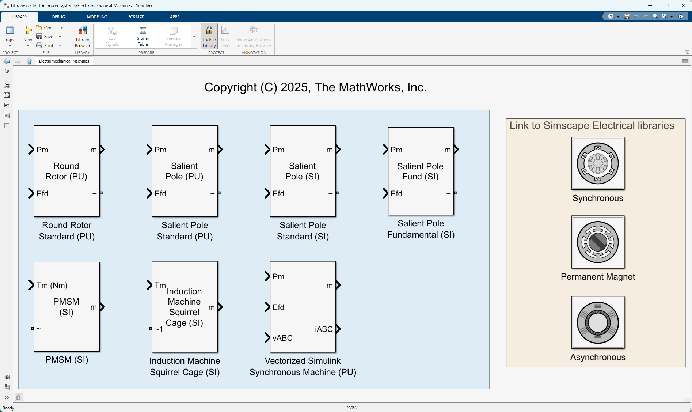
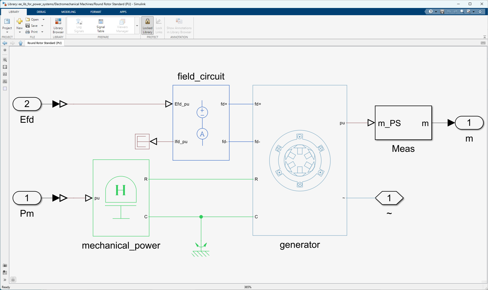

# Simscape&trade; Electrical&trade; Support Library for Power Systems Engineers

Version 1.0.1

## Introduction

The MathWorks Simscape Electrical Team has developed a support library for Simscape Electrical
that provides Power Systems Engineers with an entry point to Simscape native technology.
The library also contains links to relevant Simscape Electrical shipping libraries
for ease of navigation. For each assembled component, you can view the mask code for further detail on parameterizations and use of the Simulink API to interact with Simscape components. The Support Library comes with a number of examples that are described later in this document. The library organizes different component classifications
as 8 sub-libraries, as shown below. 

The Electromechanical Machines sub-library is shown below.
The assemblies are contained within the blue area and the links to Simscape Electrical
shipping libraries are contained within the yellow area.

The image below shows the Round Rotor Standard (PU) assembly. 

Each assembly has a parameter mask which exposes relevant parameters. 
Where applicable, there is also a check-box option to set all mask parameters
as run-time, meaning the model will not recompile if any of the mask parameters change when using Fast Restart mode, or when the model is compiled as a MEX file.

The support library comes with five sub-directories under examples. 

examples/1.component_tests contains test harnesses for a number of components within the 
Support Library.

examples/2.motor_drive contains a PMSM driven by an MMC 
converter. Each cell of the MMC has an ideal voltage source to simplify 
the control system. There are 96 individual switches in the MMC. open a0_README.mlx
for further instructions. This example also considers the performance advantage 
of using simplified diode models that fix forward voltage at 0V. 

examples/3.power_system contains a power systems example that uses MATPOWER to run a load flow
of a 30 bus system and then programmatically builds and simulates an EMT model. Navigate to the workflows
directory and open a0_README.mlx for further instructions. MATPOWER is a MATLAB Community Toolbox available at the following link https://www.mathworks.com/matlabcentral/fileexchange/72085-matpower.

examples/4.switch_fidelity contains a power electronic switch model fidelity example that describes 5 different
model fidelities for a half-bridge topology. Open model_fidelity_considerations_for_switching_devices.mlx for more information.

examples/5. visualize contains models and MATLAB scripts that visualize power system and power electronic operation. Each sub-directory has MATLAB live scripts that work through the examples.

## Tool Requirements

Supported MATLAB Version:
R2025b and newer releases

Required:
[MATLAB&reg;](https://www.mathworks.com/products/matlab.html),
[Simulink&reg;](https://www.mathworks.com/products/simulink.html),
[Simscape&trade;](https://www.mathworks.com/products/simscape.html),
[Simscape&trade; Electrical&trade;](https://www.mathworks.com/products/simscape-electrical.html)

## How to Use

Open `SupportLibraryForSSE_R2025b.prj` in MATLAB. The support library is called
ee_lib_for_power_systems.slx and can be found in the support_library directory.

The examples directory contains the examples.

## How to Use in MATLAB Online

You can try this in [MATLAB Online][url_online].
In MATLAB Online, from the **HOME** tab in the toolstrip,
select **Add-Ons** &gt; **Get Add-Ons**
to open the Add-On Explorer.
Then search for the submission name,
navigate to the submission page,
click **Add** button, and select **Save to MATLAB Drive**.

[url_online]: https://www.mathworks.com/products/matlab-online.html

## License

See [`LICENSE.txt`](LICENSE.txt).

_Copyright (C) 2025, The MathWorks, Inc._
